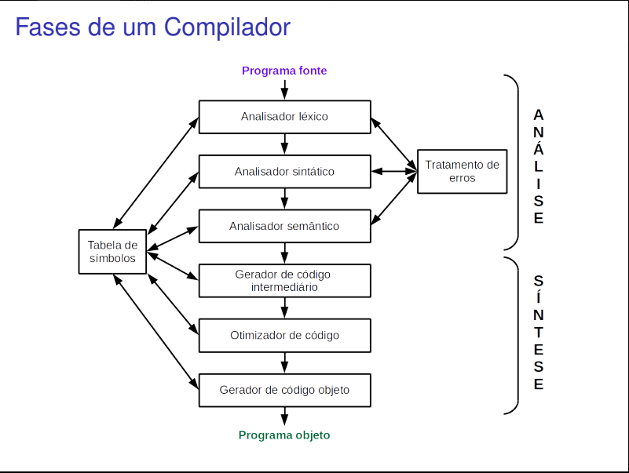

# 🚀 Compilador
Trabalho realizado na disciplina de Compiladores no curso **Ciências da computação.** 
Professora orientadora: Marcela Leite.

Esse trabalho será divido em fases, segue as fases:

________

# 📌 [Analise Léxica](analisador_lexico)
**Objetivo:** Identificar e classificar as "palavras" em uma sentença. 
*Obs:* A função principal da análise léxica é criar uma lista de `tokens` que são essas palavras. 
`Lexema` é uma sequência de caracteres reconhecidos por um padrão 

* Conceitos de forma simples
  * Lexema: o que foi enviado. ex: nomepessoa
  * token: o que é. ex: váriavel
  * Token: pode ser o conjunto todo também. ex: < lexema, token >

___
# 📌 [Análise Sintática](analisador_sintatico)
**Objetivo:** Validar a ordem dos tokens a partir da gramática, e isso pode ser feito pelas:
 `GLC >> LR >> LR` 
* Árvore de análise sintática (código intermediário e código final)
* Tabela de símbolos (ajuda a gerar o código final)

## 🛠️ Análise Descendente *(Top-Down)*
**Dervivação** (mais à esquerda)
 a cada passo: determinar a produção a ser aplicada para uma variaval 
 Usa LL

* 🏆[Analisador com descida recursiva](analisador_sintatico/top_down/descida_recursiva_v2/)
  * Exige retrocesso **backtrack** que é a recursão, mas isso demanda muito desempenho
  * Criar um procedimento para cada varíavel até achar um terminal
  * Usa **LL** (não posso ter duas produções que começam iguais)

* 🏆 [Analisador Preditivo](analisador_sintatico/top_down/analisador_preditivo/)
    * **First** é os possíveis inicios daquele terminal
    * **Follow** são as proxímas produções do proxímo terminal
    * Tenta prever o próximo token para prever o próximo passo
    * Usa a mesma lógica do automato de pilha
    * Não possui backtrack,
    * melhor que o recursivo
    * **LL(1)** pois olha a próxima produção

  

## 🛠️ Análise Ascendente *(Bottom-Up)*
Também conhecido como: **shift-reduce** ou _transferir e reduzir_ 
Mais utilizado e mais eficiente  
**Redução** | Usa **LR** Derivação mais a direita
 
`handle` um conceito da idéia que escolhe _empilhar_ ou _desempilhar_ 
Desvio representa a redução (GOTO)

* 🏆[SLR](analisador_sintatico/bottom_up/SLR/)
  * **SLR** = *(Simple LR)* Analisador simples de linguagem LR
  * Usar uma pilha pra empilhar os terminais
  * Quando conseguir "casar" com uma produção eu empilho uma variável
  * GOTO = Tabela de desvios para as produções
  * Ação = Tabela de ação informando as próximas produções

  
Forma de Backus-Naur ou **BNF** `::=`
____

# 📌 [Análise Semântica](analisador_sintatico)

* Verificação de tipos
* Verifica se a variável foi declarada
* verifica tbm questão de escopo

___________

 Outros Analisadores:

 
 

#### 📌 Gerador de código Intermediário

#### 📌 Otimizador de código

#### 📌 Gerador de código objeto

